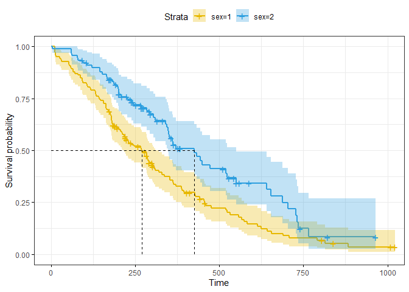

Prueba de rango logarítmico
================
Baruch Mejía Martínez
28/11/2021

Se requieren los siguientes paquetes para el análisis.

``` r
library("survival")
library("survminer")
library("Rcpp")
```

Los datos del cáncer de pulmón se utilizaron del paquete de
supervivencia.

``` r
data("lung")
head(lung)
```

    ##   inst time status age sex ph.ecog ph.karno pat.karno meal.cal wt.loss
    ## 1    3  306      2  74   1       1       90       100     1175      NA
    ## 2    3  455      2  68   1       0       90        90     1225      15
    ## 3    3 1010      1  56   1       0       90        90       NA      15
    ## 4    5  210      2  57   1       1       90        60     1150      11
    ## 5    1  883      2  60   1       0      100        90       NA       0
    ## 6   12 1022      1  74   1       1       50        80      513       0

Nos interesa comparar las curvas de supervivencia de cada grupo. Para
ello definimos una prueba de hipótesis. *H*<sub>0</sub>: En términos de
supervivencia, no hay diferencia entre los dos grupos.
*H*<sub>*A*</sub>: Existe una diferencia de supervivencia entre los dos
grupos.

*Definimos una regla de desición:* Para una significancia *α* = 0.05,
con una *χ*<sub>*c*</sub><sup>2</sup> critica correspondiente, si la
*χ*<sup>2</sup> de la prueba estadística es mayor que
*χ*<sub>*c*</sub><sup>2</sup>, rechazamos la hipótesis nula.

Convertimos los datos a un formato utilizado por la librería survival.

``` r
datos = Surv(lung$time, lung$status)
```

Hacemos el análisis haciendo el ajuste en cuanto al sexo.

``` r
model <- survfit(datos ~ sex, data = lung)
```

Esta función calcula el tiempo medio de supervivencia y sus intervalos
de confianza al 95% para cada grupo por su sexo.

``` r
summary(model)$table
```

    ##       records n.max n.start events    rmean se(rmean) median 0.95LCL 0.95UCL
    ## sex=1     138   138     138    112 326.0841  22.91156    270     212     310
    ## sex=2      90    90      90     53 460.6473  34.68985    426     348     550

Calculamos el valor de *χ*<sup>2</sup> para determinar si existe
diferencia entre los dos grupos.

``` r
surv_diff <- survdiff(Surv(time, status) ~ sex, data = lung)
surv_diff
```

    ## Call:
    ## survdiff(formula = Surv(time, status) ~ sex, data = lung)
    ## 
    ##         N Observed Expected (O-E)^2/E (O-E)^2/V
    ## sex=1 138      112     91.6      4.55      10.3
    ## sex=2  90       53     73.4      5.68      10.3
    ## 
    ##  Chisq= 10.3  on 1 degrees of freedom, p= 0.001

Obtenemos una *χ*<sup>2</sup> = 10.3. Calculamos el valor crítico
*χ*<sub>*c*</sub><sup>2</sup> para un grado de libertad.

``` r
qchisq(0.05,1,lower.tail=FALSE)
```

    ## [1] 3.841459

Dado que *χ*<sup>2</sup> &gt; *χ*<sub>*c*</sub><sup>2</sup>, rechazamos
la hipótesis nula.

Visualizamos esto gráficamente.

``` r
ggsurvplot(model,
           pval = FALSE, conf.int = TRUE,
           risk.table = FALSE, # Add risk table
           risk.table.col = "strata", # Change risk table color by groups
           surv.median.line = "hv", # Specify median survival
           ggtheme = theme_bw(), # Change ggplot2 theme
           palette = c("#E7B800", "#2E9FDF"))
```

<!-- -->

*Conclusión:* existe diferencia entre la tasa de supervivencia entre
ambos grupos. Para ser más específicos, la taza de supervivencia del
sexo 2 (426 días) es mayor a la del sexo 1 (207 días).
